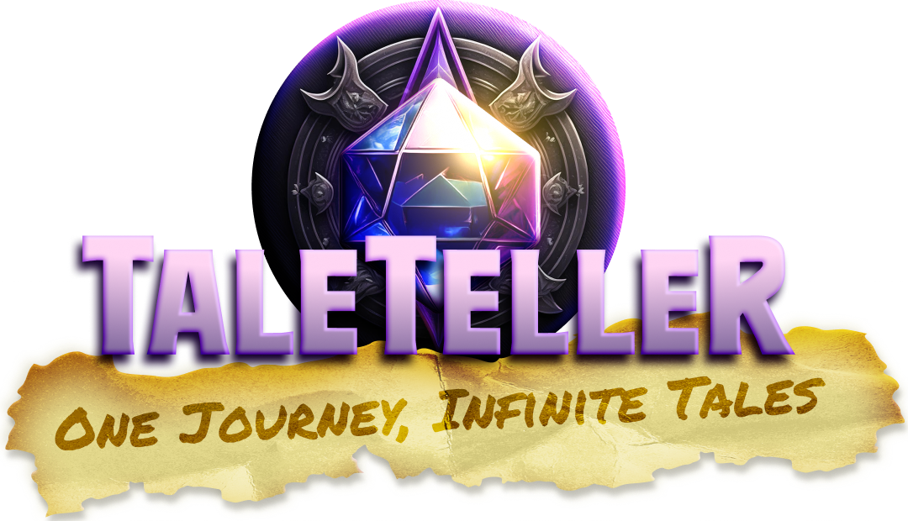

     

# TaleTeller
#### _One journey, Infinite tales_

### Introduction

TaleTeller is a dynamic tool designed to assist Dungeon Masters (DMs) create engaging tabletop RPG adventures. Whether you’re generating quests, encounters, NPCs, or entire campaign scenarios, TaleTeller simplifies the creative process, allowing you to focus on storytelling and gameplay.

### Features

- Content Generation:
Generate random encounters, NPCs, quests, adventures, and campaigns based on user-specified parameters.
- User-Friendly Interface:
Simple and intuitive UI for generating content.
- Dynamic Content Display:
Real-time display of generated quests, encounters, NPCs, and scenarios.
- Customisable Inputs:
Users can specify details like location, race, quest level, and RPG System to tailor generated content.

### Examples

#### Quest Generator

## License

MIT
